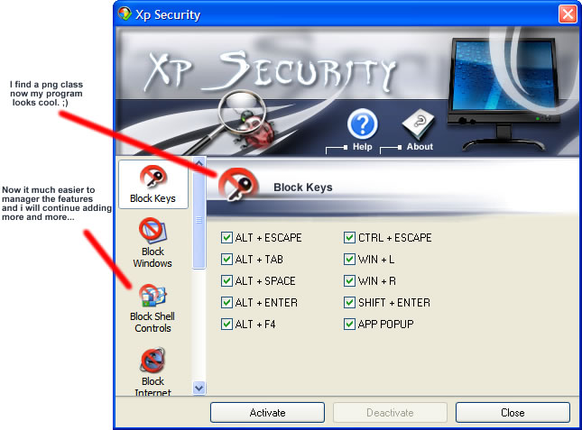

<div align="center">

## Xp Security 4 \(BETA\)


</div>

### Description

Now loaded with features and new interface...
 
### More Info
 


<span>             |<span>
---                |---
**Submitted On**   |
**By**             |[Jovica Mizdrak](https://github.com/Planet-Source-Code/PSCIndex/blob/master/ByAuthor/jovica-mizdrak.md)
**Level**          |Advanced
**User Rating**    |4.6 (32 globes from 7 users)
**Compatibility**  |VB 5\.0, VB 6\.0
**Category**       |[Complete Applications](https://github.com/Planet-Source-Code/PSCIndex/blob/master/ByCategory/complete-applications__1-27.md)
**World**          |[Visual Basic](https://github.com/Planet-Source-Code/PSCIndex/blob/master/ByWorld/visual-basic.md)
**Archive File**   |[](https://github.com/Planet-Source-Code/jovica-mizdrak-xp-security-4-beta__1-61437/archive/master.zip)


### Source Code

```
You can find Xp Security 4 at this site:
http://www.freewebs.com/jovicapro/index.htm
ps code doesnt let me upload it...
Leave comments/suggestions/vote...
```

